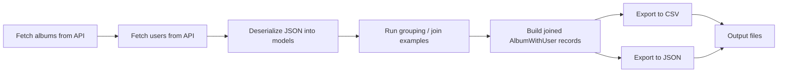

# AlbumPipeline

AlbumPipeline is a small .NET console application that fetches album and user data from JSONPlaceholder, applies simple transformation and join examples, and writes the results to CSV and JSON output files.

## What this project does

- Calls the public JSONPlaceholder API for albums and users
- Deserializes the JSON payload into C# models
- Demonstrates grouping, joining, and pipeline-style processing
- Exports the joined data to:
  - `albums.csv`
  - `albums.json`
- Logs progress to the file-based logger in the `Logging` folder

## Project structure

- `Program.cs` — entry point and sample pipeline execution
- `Core/` — reusable pipeline builder and result wrapper
- `Transformations/` — grouping and join examples
- `Persistance/` — CSV, JSON, and PostgreSQL export steps
- `Models/` — album, user, and summary models
- `Services/` — API client wrapper

## Pipeline flow



## Run the project

From the project root:

```bash
dotnet run
```

This will:
1. fetch the data,
2. process the pipeline,
3. generate the output files in the project folder.

## Notes

- The main sample pipeline is defined in `Program.cs`.
- The pipeline uses a small builder pattern in `Core/PipelineBuilder.cs` and `Core/Pipeline.cs`.
- The PostgreSQL export classes are included as optional persistence examples.

## Output files

After running the app, you should see:

- `albums.csv`
- `albums.json`

## Dependencies

- .NET 10
- Npgsql (for PostgreSQL-related persistence examples)
